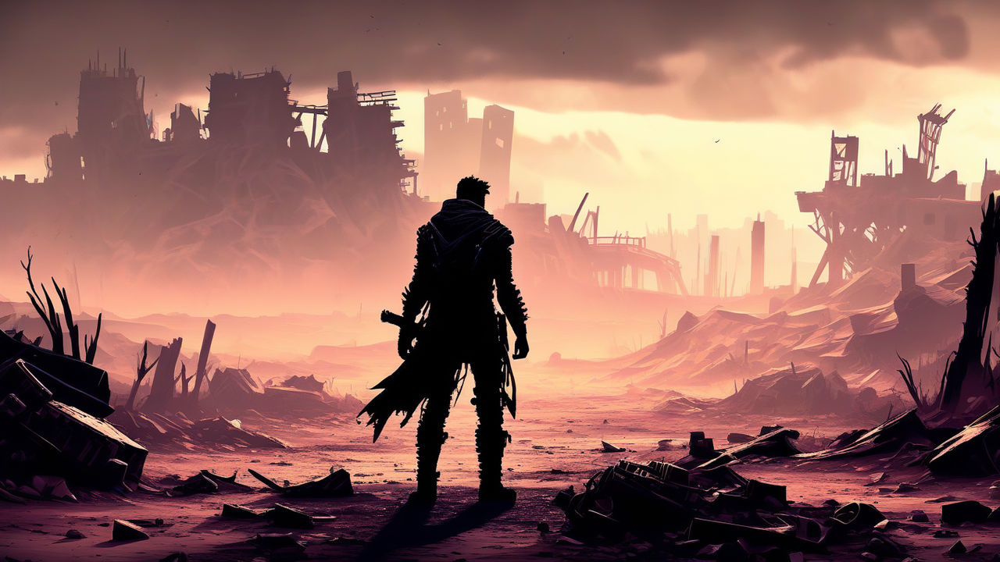

# Velocidade Mortal

**Velocidade Mortal** é um jogo de corrida infinita em um deserto pós-apocalíptico. Inspirado em estilos como Mad Max, o jogador enfrenta obstáculos em um ambiente desafiador, buscando superar a maior distância possível e atingir altas pontuações. O jogo combina uma estética imersiva e visualmente impactante com mecânicas de desafio, narrativa e descoberta, proporcionando uma experiência completa para os fãs de jogos de corrida de obstáculos.

## 🚀 Características do Jogo

- **Estética pós-apocalíptica**: Cenários de deserto devastados e veículos customizáveis ao estilo Mad Max.
- **Corrida Infinita**: Enfrente obstáculos e ganhe pontos conforme avança.
- **Sistema de Pontuação**: A pontuação é baseada na distância percorrida e nos obstáculos superados.
- **Feedback Sensorial**: Sons e gráficos que aprimoram a imersão.

## 🎮 Baixe o Jogo

Você pode baixar **Velocidade Mortal** clicando no link abaixo:

[**Baixar Velocidade Mortal**](https://danielsantdev.itch.io/deadly-speed)

## 🎮 Como Jogar

- **Objetivo**: Percorra a maior distância possível enquanto desvia de obstáculos.
- **Controles**:
  - `Espaço`: Saltar
- **Dicas**:
  - Fique atento aos obstáculos !

## 🛠️ Tecnologias Utilizadas

- **Unity**: Motor gráfico principal para desenvolvimento.
- **C#**: Linguagem de programação para scripts de controle, física e mecânicas de jogo.
- **Sistema de UI e Text**: Exibição de pontuação e informações em tempo real.
- **Physics 2D**: Implementação de colisões para detecção de obstáculos e pontuação.

## Sobre o Desenvolvedor

Criado por DanielSantDev, **Velocidade Mortal** é uma demonstração de criatividade, programação e paixão por jogos. O jogo foi desenvolvido na plataforma Unity.

## Licença

Este projeto é distribuído sob a MIT License. Consulte o arquivo LICENSE para mais detalhes.
